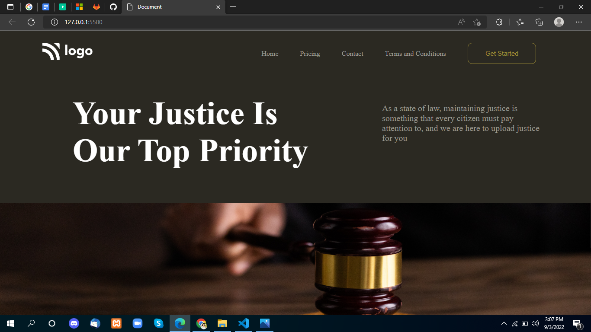

# Project-3

 

## Project live link
[https://my-project-03.netlify.app/](https://my-project-03.netlify.app/ "project03")

## Screenshot

 

## project Type
- UI Design
- One Page Website

## My learning from this Project
- Image Position absolute
- About Flex-box
- Image Fixed
- Uses Google font

## Time to make this project
#### Somthing 3 hour to make
